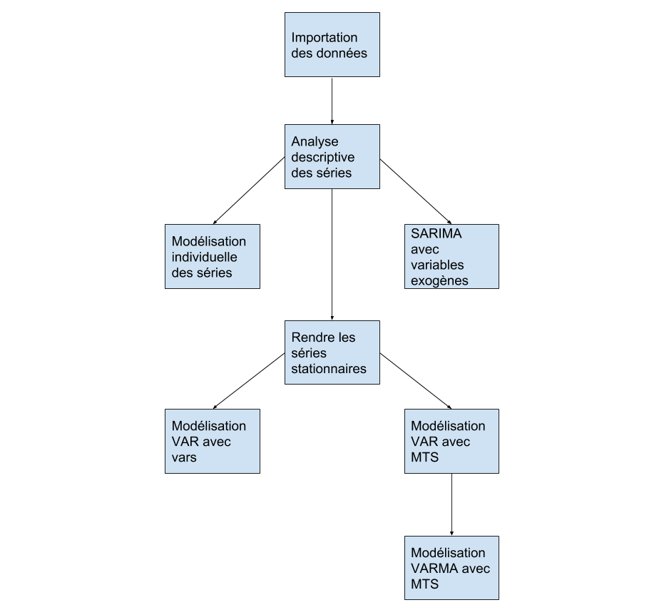

#Introduction {-}

Cette fiche a pour but de présenter le code écrit dans le cadre du projet "Identification de modèles de séries temporelles pour la prévision de la masse salariale en fonction d'informations auxiliaires" réalisé en 2018 par Jules Corbel et Paul Guillotte sous la tutelle de M. Assi N'Guessan. Pour plus de précisions par rapport à des notations, merci de vous référer à notre rapport sur ce projet [@rapport].

Le script se décompose en deux parties : un script **fonctions.R** contenant toutes les fonctions que nous avons créées afin d'automatiser des traitements et un script **main.R** pour tout les traitements.

Les différentes phases du traitement sont résumées par le schéma ci-dessous.

#Importation des packages

Afin de réaliser notre projet nous avons eu besoin d'installer un certain nombre de packages R. La liste est la suivante : 

* **tseries** qui contient le test de racines unitaires *adf.test*.
* **forecast** permettant d'effectuer des prévisions sur les modèles (lissage exponentiel, modèlesARMA, modèles VAR avec le package **vars**). L'utilisation de ce package est décrite dans un article de Rob J. Hyndman [@forecast]
* **corrplot** pour obtenir des visualisations plus parlantes de la matrice des corrélations
* **vars** qui nous permet de réaliser des modèles VAR. La vignette de ce package, écrite par Bernhard Pfaff [@vars], résume parfaitement le contenu de ce package et comment l'utiliser.

Nous utilisons également le package **MTS** pour construire des modèles VAR et VARMA, mais il n'est pas importé ici en raison de conflits avec le package **vars** sur le nom des fonctions.

#Importation des données

La ligne suivante du script est celle de l'importation du jeu de données. Il faut changer le chemin de la fonction par celui ou est stocké le jeu de données de l'IRCEM.

#Analyse descriptive des séries

Dans cette partie, nous commençons par transformer chacune des colonnes de notre jeu de données en série temporelle, allant du premier trimestre de 1990 au deuxième de 2017. Nous visualisons ensuite chacune des séries graphiquement, leurs fonctions d'autocorrélation. et testons si elles sont stationnaires grâce au test de KPSS et au test de Dickey-Fuller augmenté testant la présence de racines unitaires. Nous terminons par le découpage des séries en échantillons d'apprentissage et de test.

#Modélisation individuelle des séries

Cette partie se décompose en deux : la réalisation de modèles par lissage exponentiel puis par processus ARMA sur chacune des séries. Nous visualisons les résultats grâce à l'AICc et à l'erreur quadratique moyenne, résultats qui sont comparés à la fin de la partie. Nous estimons également la valeur du PIB pour le deuxième trimestre de 2017, puisque nous ne l'avons pas, à l'aide du meilleur des deux modèles pour cette série.

#Modélisation ARMA avec variables exogènes

Comme pour la modélisation individuelle, nous effectuons tous les modèles possibles, soit en utilisant toutes les combinaisons de variables auxiliaires. Les résultats sont présentés à la fin dans la matrice *resultats*.

# Stationnarisation des séries

Cette partie est indispensable pour la construction des modèles VAR. En effet, chacune des séries est stationnarisée grâce à la fonction *decompose* permettant de séparer la composante de tendance, la composante saisonnière et la composante résiduelle dans une série. Nous conservons donc uniquement la composante résiduelle pour toutes les séries. Nous vérifions que ces composantes sont bien stationnaires grâce aux mêmes méthodes que précédemment (fonctions ACF et PACF, test KPSS et test de Dickey-Fuller augmenté). Nous gardons toutefois les composantes de tendances et de saisonnalité pour la variable MSE, car elles nous serviront à reconstruire la série et donc effectuer des prévisions.

#Mise en place de modèles VAR avec vars

Pour toutes les combinaisons de variables comprenant la MSE, nous déterminons les ordres du modèles associés à chacun des critères à notre disposition et estimons un modèle pour chacun de ces ordres. Nous vérifions ensuite que les hypothèses associées au modèle VAR sont bien respectéeset calculons l'erreur quadratique moyenne pour chaque modèle et visualisons graphiquement les prédictions par rapport à la série réelle. Le tableau à la fin de la partie nous donne l'erreur quadratique moyenne pour le meilleur modèle en terme de prédiction par combinaison de variables.

#Mise en place de modèles VAR avec MTS

La méthodologie adoptée est la même qu'avec le package **vars**, à ceci près que ce package contient moins de moyens de vérifier les hypothèses du modèle, nous n'avons donc vérifié que celles qui étaient possibles.

#Mise en place de modèles VARMA avec MTS

Nous terminons par la construction d'un modèle VARMA. Nous commençons par estimer l'ordre du modèle grâce au calcul des matrices de corrélation croisée étendues. Nous construisons ensuite le modèle, dont un grand nombre de paramètres n'est pas significatif. Nous tentons donc de supprimer les paramètres non significatifs, mais sans succès.

\newpage
#References